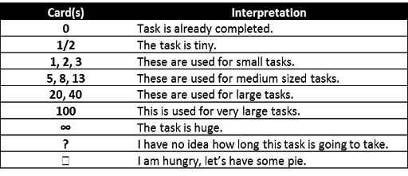
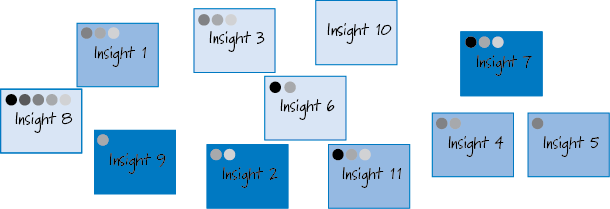
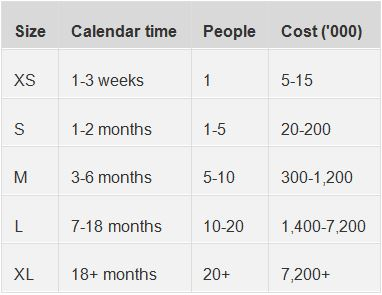

# Software Quality Assurance handbook

## Introduction

This document is an handbook of best practices which highlights the good / bad methods to avoid / follow in order to carry out a project successfully in a company.

You will find bellow the different topics to be aware of in order to produce efficiently for a project.

- [**Task Estimation**](#task-estimation)
  - [**Agile/Scrum estimation concept**](#A.agile/scrum-estimation-concept)
  - [**The different methods of task estimation**](#B.-The-different-methods-of-task-estimation)
    - [**Poker planning**](#B.1-poker-planning)
    - [**Dot voting**](#2-2.-dot-voting)
    - [**T-Shirt Sizes**](#2-3-T-Shirt-Sizes)
    - [**Ordering Procotol**](#ii.iv.-Ordering-Procotol)
  - [**Conclusion**](#3.-To-conclude)
- [**Coding Standards**](#coding-standards)
  - [**Files Organization**](#1.-Files-Organization)
    - [**Delivery folder content**](#1.1.-Delivery-folder-content)
    - [**File extension**](#1.2.-File-extension)
    - [**File coherence**](#1.3.-File-coherence)
    - [**Naming and folders**](#1.4.-Naming-and-folders)
  - [**Global Organization**](#2.-Global-Organization)
    - [**File Header**](#2.1.-File-Header)
    - [**Functions separator**](#2.2.-Functions-separator)
    - [**Global Variables**](#2.3.-Global-Variables)
  - [**Functions**](#3.-Functions)
    - [**Functions coherence**](#3.1.-Functions-coherence)
    - [**Naming convention**](#3.2.-Naming-convention)
    - [**Number of lines**](#3.3.-Number-of-lines)
    - [**Functions arguments**](#3.4.-Functions-arguments)
    - [**Comments**](#3.5.-Comments)
    - [**Nested functions**](#3.6.-Nested-functions)
  - [**Layout inside a function**](#4.-Layout-inside-a-function)
    - [**Line content**](#4.1.-Line-content)
    - [**Indentation**](#4.2.-Indentation)
    - [**Spaces**](#4.3.-Spaces)
    - [**Brackets**](#4.4.-Brackets)
  - [**Variables**](#5.-Variables)
    - [**Declaration**](#5.1.-Declaration)
    - [**Naming**](#5.2.-Naming)

---

## Task Estimation

First of all, before any planning for the realization of a project, there is necessarily an estimation stage. The evaluation of the realization of a task can be based on different notions such as man-days, hours, points or even t-shirt sizes (XS, S, M, L, XL...).

### A.**Agile/Scrum** estimation concept

During a **Agile or Scrum** estimate, all the people who can bring something to the project are invited and involved. This allows everyone to express their point of view and thus obtain a much broader vision of the functionality to be estimated and the solutions that can be implemented. The responsibility for the estimation is shared equally among all team members and is not attributable If the estimation is incorrect, the whole team is responsible. Everyone will therefore become more involved and will not be afraid to express their opinion.

These estimates are based on a compromise between project team members. This is not an activity that brings real added value to the project, so it should take as little time as possible. This is why an agile estimate will never be expressed in man-days, hours or even euros. It is a qualitative estimate and not a quantitative one. We will estimate the complexity of a task, based on experience and similar tasks.

The complexity of the accomplishment of a task will be measured using a qualitative unit, usually a number of points. This greatly simplifies the estimation. To summarize, in an Agile or Scrum estimation, a difficulty is estimated in number of points based on references and experience on similar tasks previously performed.


### B. The different **methods** of task estimation

There are several agile estimation methods, each with its advantages and disadvantages. Nothing prevents the team from changing estimation methods every sprint until they find the one that best suits your agile team.

#### B.1 Poker planning

Certainly the most widespread method of estimation in Scrum.

Participants use a specially designed card game for poker planning. The cards have the values 0, 0.5, 1, 2, 3, 5, 8, 13, 20, 40, 100, "∞" and "?". The values represent estimates in number of points. Low values are for the simplest tasks. Values 3, 5 and 8 are generally used for slightly more complex tasks. The value 100 is usually used for a task that is too complex and needs to be split up and spread over several sprints. The value "∞" represents a task that is far too long or complex to be embedded in the sprint, and "?" indicates that it is not possible to provide an estimate based on the team's current state of knowledge.

Each feature is presented, after which each participant in the poker schedule can vote. The cards are laid face down so that no one knows who votes what. If a consensus is not reached, everyone can discuss the feature again. Votes and discussions follow each other until a majority decides on the estimate. The process is repeated for each feature presented, usually two to ten per poker schedule.

If you want to know more, feel free to check out this link: https://www.mountaingoatsoftware.com/agile/planning-poker



#### 2.2 Dot voting

This method is usually used as a decision support tool. Nevertheless, it is well suited for quickly estimating a small number of functionalities.

The list of features to be estimated is displayed and each participant is given a small number of voting points (5 for example). Each participant then distributes his or her points on the different features. It is possible to put several points on the same feature if it is estimated that it is more complex or longer to achieve than the others.

Once everyone has distributed all their points, the total is added up and a score is given for each feature. The higher the score, the longer or more complicated the feature is going to be.

If you want to know more, feel free to check out [this link](https://www.nngroup.com/articles/dot-voting/)



#### 2.3. T-Shirt Sizes

This is an informal technique, particularly suitable for quickly processing a large number of functionalities. The categories used are t-shirt sizes: XS, S, M, L XL.

Each feature is discussed among the participants, in order to estimate in which category it fits. Naturally, the XS category will contain features that are easy to implement, XL will contain the most complex and difficult ones. A vote can be organized if the participants cannot agree during the discussion.

If you want to know more, feel free to check out this link: https://blog.trello.com/t-shirt-sizes-project-estimation-technique



#### ii.iv Ordering Procotol

Functionalities are initially randomly divided into two categories: "low" and "high". Each participant then has the opportunity to perform an action. An action can consist of moving a record from one category to another, starting a discussion about a feature or skipping one's turn. Once everyone has performed an action, the feature ranking is final.

### 3. To conclude

There are many methods for estimating tasks (you can easily find variants of those described). Don't hesitate to test several of them, to change estimation methods from one sprint to another, and thus determine the one that best suits the project, with which team members are most comfortable. You can also adapt the agile estimation method to the needs of the project, depending on the number of features to be analyzed and the size of the team. Depending on these criteria, some methods will be better adapted than others, and therefore more efficient.

- Additional resources: - https://www.guru99.com/an-expert-view-on-test-estimation.html - https://www.projectmanager.com/blog/5-tips-for-task-estimating - https://www.atlassian.com/agile/project-management/estimation

---

## Coding Standards

The Coding Standard also know as Coding Stlye is a set of rules, guidelines and programming conventions created within the company to build software uniformly. It helps other developers to understand code regardless of his author and it allows smoother code reviews.

In other words, standardization of code facilitate :

- Readability
- Debuging
- Maintenance
- Business Logic
- Reusability
- Testing

The following coding style applies to every program inside the company. No matter which product or service you are working on, you should follow the guideline.
The following parties explain how you should write and organize your code.

### 1. Files Organization

#### 1.1. Delivery folder content

Your delivery folder should only contains file required for compilation. Any post-compilation generated file and temporary file should not be inclued in your delivery folder.

**Good delivery folder tree**

    main.c
    src/
        print.c
        strings.c
        format.c
        compute.c
    headers/
        print.h
        strings.h
        format.h
        compute.h

**Bad delivery folder tree**

    main.c
    main.o
    ~main.tmp
    src/
        print.c
        print.o
        ~print.tmp
        strings.c
        strings.O
        ~strings.tmp
        format.c
        format.o
        ~format.tmp
        compute.c
        compute.o
        ~compute.tmp
    headers/
        print.h
        strings.h
        format.h
        compute.h

#### 1.2. File extension

Sources in your program, should only have files with the correct extension of the project.

#### 1.3. File coherence

A source file should match a logic, and group all the functions associated.

    /!\ You should consider subdivide your code in multiple files if you have more than 5 functions.

#### 1.4. Naming and folders

The name of the file should represent the logical entity it defines, and thus be clear, precise and explicit.

**Clear, precise and explicit filename**

    get_articles.c
    get_comments.c
    get_authors.c

**Unclear filename**

    write.c
    find.c
    algo.c

Every folders and filenames should be in English and formatted according to the snake_case convention (composed only of lowercase, numbers, and underscores).

**good filename**

    get_articles.c
    get_comments.c
    get_authors.c

**bad filename**

    GetArticles.c
    GetComments.c
    GetAuthors.c

### 2. Global Organization

#### 2.1. File Header

The source files must always start with the formatted header of the company. A Visual Studio Code extension is available to automatically generate the header.

    **************************************
    @company - company.io
    @project - Computer Vision Toolbox
    @author  - john@company.io
    @updated - 2020-04-05 18:35:02
    **************************************

#### 2.2. Functions separator

Each function inside a file should be separated by one empty line.

**Good function separation**

    int multiply(int x, int y) {
        ...
    }

    int main() {
        ...
    }

**Bad function separation**

    int multiply(int x, int y) {
        ...
    }
    int main() {
        ...
    }

#### 2.3. Global Variables

You should only use global variables when it comes to constant variable. Any non-constant variable should not be global.

Global variable should follow SNAKE_CASE (ALL CAPS) standard.

**Good Global Variable**

    const float VALIDITY_THRESHOLD=70.5

**Bad Global Variable**

    const int AGE=20
    const int threshold=20

### 3. Functions

#### 3.1. Functions coherence

A function should only do one thing and should not mix functionality.

**Good function**

    int multiply(int x, int y) {
        return(x * y);
    }

**Bad function**

    int compute(int x, int y) {
        int b = x + y
        int c = b + y

        for (i = 1; i < 11; ++i) {
            printf("%d ", i);
        }

        i = b + x
        for (b = 1; i < 11; ++i) {
            printf("%d ", i);
        }
    }

#### 3.2. Naming convention

A function should describe what it does. It must contains a verb and be explicit.

All function names should be in English, according to the snake_case convention (meaning that it is composed only of lowercase, numbers, and underscores).

**Good function name**

    int create_user(int age, char **name) {
        ...
    }

**Bad function name**

    int usr(int a, char** n) {
        ...
    }

    INT USR(INT A, CHAR **N) {

    }

    int CREATE_USER(int AGE, char **NAME) {
        ...
    }

#### 3.3. Number of lines

A function should be as small as possible. The longer the function is the most difficult testing will be difficult.

#### 3.4. Functions arguments

A function taking no parameters should take `void` as unique argument.
A function should not need more than 4 arguments

**\*Good functions arguments**

    int get_timestamp(void) {
        return date.now()
    }

    int multiply(int x, int y) {
        return(x * y);
    }

**\*Bad functions arguments**

    int create_user(int age, char **firstname, char **email, char **lastname, char **phone_number) {
        ...
    }

#### 3.5. Comments

There should be no comment within a function.
The function should be readable and self-explanatory but comment are allowed above the function to explain it.

#### 3.6. Nested functions

Nested functions are not allowed because it increase com- plexity.

### 4. Layout inside a function

#### 4.1 Line content

A line should correspond to only one statement.

Avoid to :

- have several assignments on the same line
- have several semi-colons on the same line, used to separate several codesequences
- a condition and an assignment on the same line

for exemple, avoid :

```
a = b = c = 0;
```

or

```
a++; b++;
```

#### 4.2 Indentation

All files in the project must have the same indentation

#### 4.3 Spaces

Always place a space after a comma or a keyword

for exemple :

```
return(1); => KO
return (1); => OK
```

#### 4.4 Brackets

Opening curly brackets should be at the end of their line.
Closing curly brackets should always be alone on their line, except in the case of an else statement.

for exemple :

```
if (cond) {
    ...
} else {
    ...
}
```

### 5. Variables

#### 5.1 Declaration

Variables should be declared at the beginning of the scope of the function

#### 5.2 Naming

All identifier names should be in English and represent the variable

# Blog **Posts**

https://medium.com/@marilu597/general-coding-guidelines-clean-code-from-day-1-9ab0804e5d91

https://www.geeksforgeeks.org/coding-standards-and-guidelines/

https://levelup.gitconnected.com/write-better-code-with-coding-standards-546faf3fd4d1

https://medium.com/level-up-web/what-is-a-programming-style-guide-and-why-should-you-care-9019e51bb7ad

- [**Code Reviews**](#code-reviews)

# Software Quality Assurance

## Code Review

### Introduction

Let's start with a little definition. Code review is a review of a piece of code before it is added to the overall source code of an application. This review aims to detect (among other things) non-compliance with best practices, architectural weaknesses, forgotten "dead code" ... Code review is a fairly common practice in development. This practice can be implemented regardless of the size of the teams. Having an effective code review policy is time consuming and may seem at first glance to be an unnecessary cost. However, it offers many advantages, some directly visible, others more latent:

- The quality of the code is obviously improved, it becomes more maintainable, better architected...
- As mentioned above, the number of bugs is reduced;
- Communication and collaboration between team members is increased;
- Reading code has a formative effect on the project team;
- The knowledge of the project is correctly spread over the whole team.

It is therefore essential to know the best practices of code reviewing.

### Best Practices

This practice can be divided into two categories. You can do automated checks for some of the things — e.g., structure and logic. But others — e.g., design and functionality — require a human reviewer to evaluate. We will therefore first talk about good practices in the case of a manual code review.

#### Manual Code Review

- Take your time. Never exceed 60 minutes of examination time at a time. Performance and attention to detail tend to decrease after this point. Studies show that taking breaks from a task for a period of time helps to maintain workflow without sacrificing much of its quality. So if the task requires a great deal of attention from you, it is best to take a break. During this break, think about something else, clear your head. This way, when you resume the code review, you will get a fresh look at the code. So if your review lasts more than 60 minutes, take a break.

- Review Less Than 400 Lines Of Code. As well as the time spent reviewing code, reviewing too much code is also counterproductive. Try to limit each review session to 400 lines or less. A lot of research shows that beyond this line limit, the brain can no longer process information efficiently. Keep in mind that code review is a matter of quality rather than quantity. If a team decides to exceed the 400 LOC limit, the ability to find defects is severely affected. It is estimated that if a code examination is performed on less than 400 lines, in several times if necessary, it would cover 70 to 90% of defects.

#### Automatic Code Review

- Automate to Save Time. Despite good practices, reviewing the code remains a very time-consuming task. It is therefore important to automate what can be automated using the right tools. One such tool is static code analyzers, for example, which detect potential problems in the code by comparing it to coding rules. Running static code analyzers on code minimizes the number of problems that reach the peer review phase.

- Lookout For The Key Metrics. Of course, you need to know what to look for in the case of automatic code examination. Closely monitor internal process parameters such as inspection rate - the speed at which an examination is performed -, defect rate - the number of bugs identified per hour of examination -, defect density - the average number of bugs per line of code. These are the metrics that will give you a global view of the state of your code.

- Immediately Fix Defects Found. C'est parfois dure de quitter ça tâche actuel pour revenir sur un bug fraîchement découvert. Ce n'est pas parse que vous arrêtez votre tâche actuel pour s'occuper d'un bug que vous allez être en retard sur votre travail. Au contraire, le but est de ne pas laisser les bug s'accumuler au file du temps.

### Bad Practices

- Too many comments. When a person makes a mistake, chances are they have made the same mistake in several places. Do not drown the person who is going to correct the code under your comments. By doing so, you may just discourage the person. Grouping comments together allows you to convey the same message without overwhelming the review requester. It will also make the correction clearer.

- No opinion here. You must remain completely neutral on your examination. It is especially important not to pass off your opinion as fact when you have higher rank and authority within your team or company. If you do this, developers will feel they have no choice but to quietly implement your demands.

- Staying professional. Although the task may seem boring to you, that's no reason to be distracted. So there is no need for jokes or inappropriate vocabulary. A person reading may not understand the overall meaning of your comment. We don't doubt your humour, no worries. ;)

- Try to not hurts. Finally, don't forget that in case you examine code that is not yours, you can yell at the creator of that code. You are looking at a human being, not a machine. So try to be constructive in your comments, rather than critical. You can do this by asking questions rather than making statements. And don't forget to praise in addition to your constructive comments. It's good for team cohesion.

Additional resources:

    https://medium.com/cuelogic-technologies/code-review-process-best-practices-3eeecab26ded

    https://www.perforce.com/blog/qac/9-best-practices-for-code-review

    https://medium.com/palantir/code-review-best-practices-19e02780015f

    https://medium.com/@sandya.sankarram/unlearning-toxic-behaviors-in-a-code-review-culture-b7c295452a3c

    https://techbeacon.com/app-dev-testing/how-sabotage-code-review
